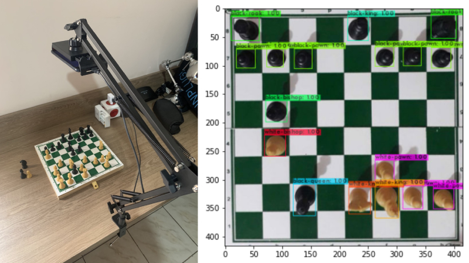
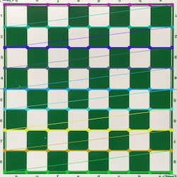

# Chess Recognition

This project uses computer vision techniques to detect objects on a chessboard. The data are converted into an 8x8 `numpy` matrix which is passed to the `minimax` algorithm to suggest a move.

We use the `Darknet` framework to train the `Yolov4` neural network to detect the pieces and map the board using `OpenCV`

<p><strong>Object Detection</strong></p>


<p>
  <br/>
  <strong>Board mapping</strong>
</p>


<p>
  <br/>
  <strong>Find board coordinates</strong>
</p>


<p>
  <br/>
  <strong>Mapped board</strong>
</p>


# Notebooks

| Title     | Description | Link |
|:----------|:-----------|-----:|
| ♟️ Chess Piece Detection | Use [**Darknet**](https://github.com/AlexeyAB/darknet) to detect pieces | [](https://colab.research.google.com/drive/1nrTyy-m-xG6vmG6klsLm1dTlLJYQTnrM) |
| 📷 Game Board Mapping | Find the playable area of the board | [](https://colab.research.google.com/drive/13r2HiJeB9G4eQP5a9WTQE_NyeiGQHnF6) |
| 🖼️ Image Data Augmentation | Data augmentation techniques | [](https://colab.research.google.com/drive/1NXRUnvztSCs7IljH8vXqEIIsFF0IPaTH) |

# Database

I created and annotated my own database using [LabelImg](https://github.com/heartexlabs/labelImg), below you can download them and see how I did it.

| Title     | Description | Link |
|:----------|:-----------|-----:|
| 📦 Chess Piece v6 Database | Raw database without modifications | [Download](https://drive.google.com/file/d/1KvuBo4yffhk6qOmXtHssaKBnEPfiS2uH/view?usp=sharing) |
| 📦 Chess Piece v6 Database Augmented | The above database with data augmentation | [Download](https://drive.google.com/file/d/1mS0MotZOeCf2-Th1vQEqNIrUY_MiW9hj/view?usp=sharing) |

# Get started

Some configurations are necessary to run the project:

1. [Get YOLO weights file](#1-get-yolo-weights-file)
1. [Configure the camera](#2-configure-the-camera)
1. [Virtual environment](#3-virtual-environment)
1. [Install dependencies](#4-install-dependencies)
1. [Board mapping](#5-board-mapping)
1. [Start](#6-start)

<details>
  <summary>

  ## 1. Get YOLO weights file
  </summary>

  Get the file containing the YOLO neural network weights, you can download it at [yolov4_last.weights](https://drive.google.com/open?id=1aY6yIKVfnFlzLUU2jj9bumMCjMJRT9U1), after downloading move the file to `assets/dnn/yolov4_last.weights`
</details>

<details>
  <summary>

  ## 2. Configure the camera
  </summary>

  > 
  > **NOTE**
  >
  > Skip this section if you just want to run the example project
  >

  In `src/.env` you must specify a camera source, you can do this by setting the `CAM_ADDRESS` parameter. Valid options are:

  | Option     | Example |
  |:----------|:------------|
  |IP | `http://192.168.0.111:4747/video` |
  | device index | `0` (You can select the second camera by passing 1 and so on) |
  | video file | `/path/file.mp4` |
</details>

<details>
  <summary>

  ## 3. Virtual environment
  </summary>

  Maybe you want to create a virtual environment using [miniconda](https://docs.conda.io/en/latest/miniconda.html) before run start.

  >
  > **Create Env with conda**
  >
  > ```conda create -n chess_recognition python=3.9 pip --yes```
  
  >
  > **Activate env**
  >
  > ```conda activate chess_recognition```
  >
</details>

<details>
  <summary>

  ## 4. Install dependencies
  </summary>

  >
  > **NOTE: Apple Silicon M1**
  >
  > When Apple switched from Intel chips to internal Apple Silicon chips, they switched from x86 architecture to ARM64 architecture. If you have a Macbook with an M1 chip, you may experience problems installing certain packages. To work around this use the **Rosetta terminal**. 
  >

  After create and activate your environment you must install all the dependencies that the project needs to work. Run the following command in your terminal:

  ```bash
  pip install -r requirements.txt
  ```
</details>

<details>
  <summary>

  ## 5. Board mapping
  </summary>

  Before we can start the project we need to calibrate the board, you can do this using the command `python3 src/main.py --mapping`.

  **NOTE:** _Run this command in the root of the project and not inside `src`_

  If all goes well, you should see output similar to this one.

  ```bash
  frame resolution: (480, 480)
  /path/chess_recognition/debug/1_raw.jpg
  /path/chess_recognition/debug/2_biggest_cnt.jpg
  /path/chess_recognition/debug/3_playable_area.jpg
  /path/chess_recognition/debug/3.1_padding.jpg
  /path/chess_recognition/debug/4_squares_corners.jpg
  /path/chess_recognition/debug/5_mapping.jpg
  Squares Average......: 3190.3125
  Done!
  ```

  Then `chessboard-mapping.json` file must be created in the root of the project. You can look in the `debug` directory step by step calibration of the board, if you don't want to see those logs anymore set `DEBUG=0` in `.env`

  Note that in `.env` we define the camera for an example video file:
  
  ```bash
  # src/.env
  CAM_ADDRESS=assets/videos/cam_example.mp4
  ```

  If you want to test with your own file or the your device camera, you must change this env and then calibrate your board. To calibrate your board, go to the `Game` class, `mapping` method, line `79` and change the parameters according to your needs:

  | Parameter | Description |
  |:----------|:------------|
  | `add_padding` | A boolean indicate if image need a padding. Default is `False` |
  | `fix_rotate` | A boolean indicate if image need a rotate. Default is `False` |
  | `rotate_val` | The values of rotate if `fix_rotate` is `True`. Default is `-90` |
  | `apply_kdilate` | A booelan indicate if image need expand your contours. Default is `True` |
  | `smooth_ksize` | A tuple of Gaussian Blur ksize. Default is `(11, 11)` |
</details>

<details>
  <summary>

  ## 6. Start
  </summary>

  Now you are ready to start the game, go and run `python3 src/main.py --start`

  **NOTE:** _Run this command in the root of the project and not inside `src`_
</details>

# Running

[](https://www.youtube.com/watch?v=3o1dMs6xAT0 "Assistir no Youtube")

[](https://www.youtube.com/watch?v=9dsYuFIf6_c "Assistir no Youtube")

# Troubleshooting

## Could not load the Qt platform plugin "xcb"

```
qt.qpa.plugin: Could not load the Qt platform plugin "xcb" in "" even though it was found.
This application failed to start because no Qt platform plugin could be initialized. Reinstalling the application may fix this problem.

Available platform plugins are: eglfs, linuxfb, minimal, minimalegl, offscreen, vnc, xcb.

Aborted (core dumped)
```

**Resolution**

Just remove the damn

```
~/miniconda3/envs/envname/lib/python-3.9/site-packages/cv2/qt/plugins
```

https://github.com/wkentaro/labelme/issues/842#issuecomment-826481652

# References
   - https://jsfiddle.net/q76uzxwe/1/
   - https://www.freecodecamp.org/news/simple-chess-ai-step-by-step-1d55a9266977/
